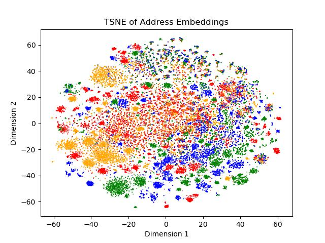

# Training Sequence-to-Sequence Models for Postal Codes Embeddings
This repository details the training of an LSTM [Sequence-to-Sequence](https://arxiv.org/abs/1409.3215) (Seq2Seq) Model by Sutskever et. al. using the text of Singapore addresses. It feeds the output cell states of the LSTM encoder into an LSTM decoder. For information, the LSTM decoder includes a parallel feed-forward mechanism, although the decoder will be of interest after the training is complete (since our interest is in the overall address embedding).

Before training the Seq2Seq model, first process the addresses by running
```
python process_postal_codes_word.py
```
to get the word dictionaries and generate the word indices prior to training. Then run the command
```
python train_postal_codes_tf_ver2_lstm_seq2seq.py
```
to train the Seq2Seq model. Save the model's parameters accordingly by setting the `model_ckpt_dir`.

After the model is trained, open the notebook `infer_postal_codes_word.ipynb` to extract the embeddings. In this case, we simply take the concatenation of the cell states of the LSTM encoder as the overall address embedding. We perform dimension reduction using TSNE on the postal codes starting with "01", "04", "08" and "11" to check whether the address embeddings makes sense. Generally speaking, the embeddings of the postal codes in different areas of Singapore should have its own cluster. 

The figure below shows the embeddings of the above 4 postal clusters, with "01" being red, "04" being orange, "08" being "green" and "11" being "blue". As can be observed, there is some degree of separation among the 4 clusters.


